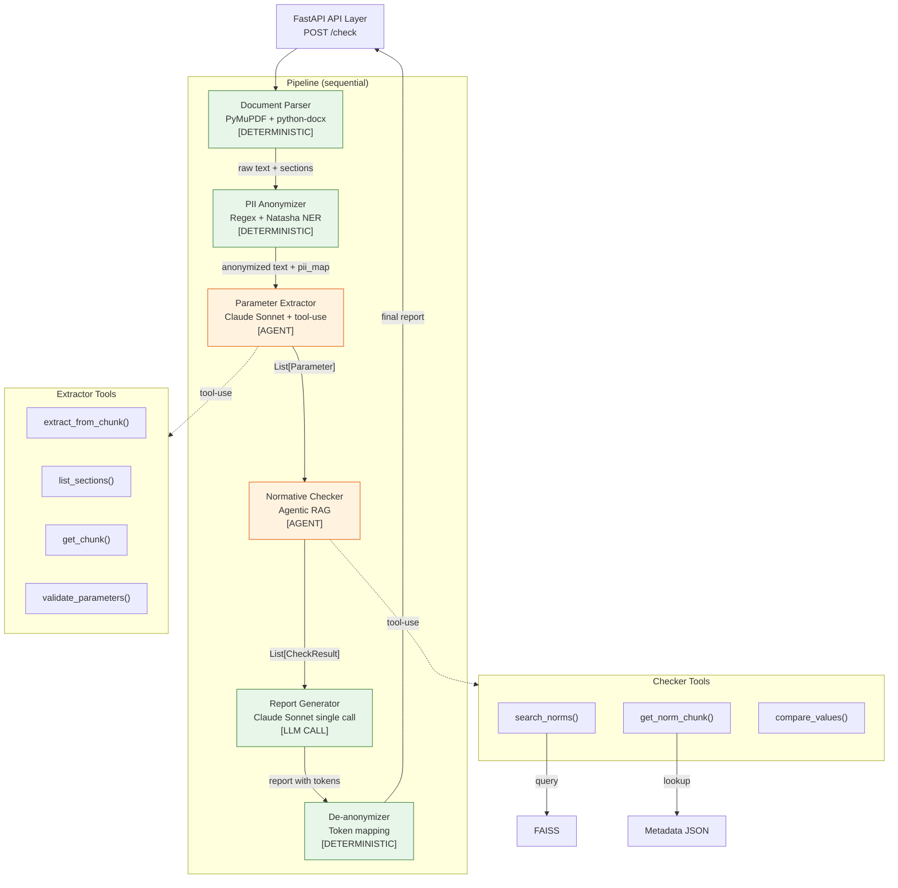

# C4 Component: SpecControl AI Backend

## Описание

Внутреннее устройство Python backend — 6 модулей pipeline и их взаимодействие.
Уровень C4 Level 3. Зелёный цвет — детерминированные модули, оранжевый — агентные.

## Диаграмма

## Модули

| Модуль | Тип | Вход | Выход |
| ------ | --- | ---- | ----- |
| Document Parser | Deterministic | PDF/DOCX file | raw text + sections |
| PII Anonymizer | Deterministic | raw text | anonymized text + pii_map |
| Parameter Extractor | Agent (tool-use) | anonymized text | List[Parameter] |
| Normative Checker | Agent (Agentic RAG) | List[Parameter] | List[CheckResult] |
| Report Generator | LLM call (single) | List[CheckResult] | report text (с токенами PII) |
| De-anonymizer | Deterministic | report + pii_map | final report |
