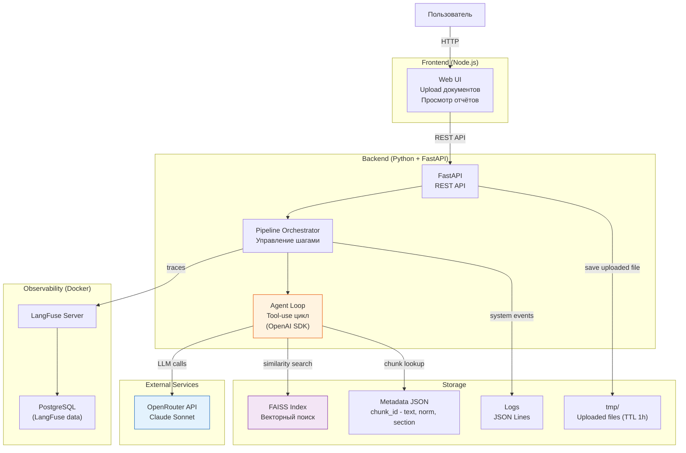

# C4 Container: SpecControl AI

## Описание

Показывает внутреннее устройство системы на уровне деплоймент-единиц: frontend, backend API, vector store, observability.
Уровень C4 Level 2 — каждый контейнер является отдельной запускаемой единицей.

## Диаграмма

## Контейнеры

| Контейнер | Технология | Назначение |
| --------- | ---------- | ---------- |
| Web UI | Node.js | Загрузка документов, отображение отчётов |
| FastAPI | Python | REST API, pipeline orchestration |
| Agent Loop | Python (OpenAI SDK) | Tool-use агентный цикл для LLM |
| FAISS Index | faiss-cpu (Python) | Векторный поиск по нормативной базе |
| Metadata JSON | Файл .json | Маппинг chunk_id — текст и метаданные норматива |
| LangFuse | Docker (self-hosted) | LLM tracing, cost tracking |
| PostgreSQL | Docker | Хранение данных LangFuse |
