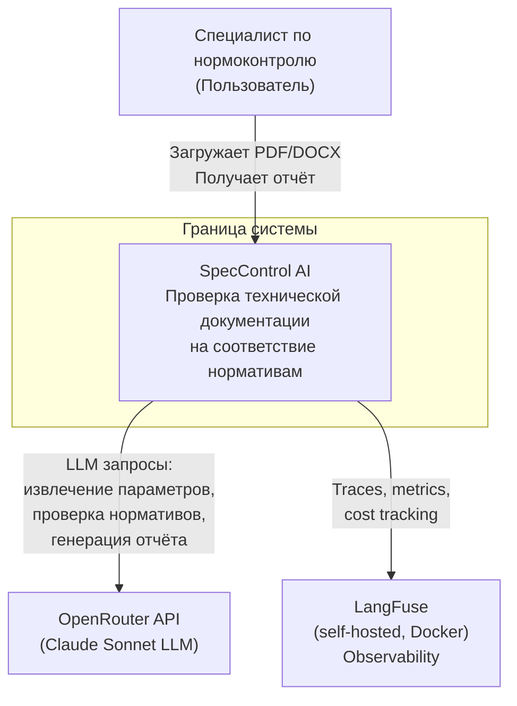

# C4 Context: SpecControl AI

## Описание

Диаграмма показывает систему SpecControl AI как единый блок, её пользователей и внешние зависимости.
Уровень C4 Level 1 — система как чёрный ящик: кто с ней взаимодействует и на какие внешние сервисы она опирается.

## Диаграмма

## Внешние зависимости

| Сервис | Тип связи | Критичность | Fallback |
| ------ | --------- | ----------- | -------- |
| OpenRouter API | HTTP REST | Критичен (без LLM система не работает) | Retry 3x exp. backoff, сообщение пользователю |
| LangFuse | HTTP | Некритичен (observability) | Система работает без LangFuse, логи пишутся локально |
