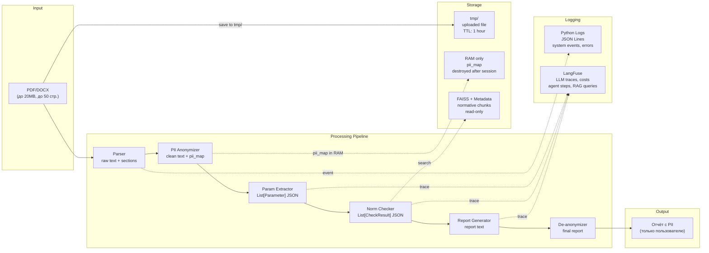

# Data Flow: SpecControl AI

## Описание

Показывает путь данных через систему: какие данные на каждом этапе, что хранится, что логируется, что удаляется.
Пунктирные стрелки — запись/чтение в хранилище или трассировка (не основной поток обработки).

## Диаграмма

## Классификация данных

| Данные | Где хранятся | Срок жизни | Содержит PII |
| ------ | ------------ | ---------- | ------------ |
| Загруженный файл | tmp/ | 1 час / конец сессии | Да — не отправляется в LLM |
| Raw text | RAM (SessionState) | До конца сессии | Да — не отправляется в LLM |
| pii_map | RAM only | До конца сессии | Да — не логируется |
| Anonymized text | RAM (SessionState) | До конца сессии | Нет |
| Parameters JSON | RAM + LangFuse trace | До конца сессии / 30 дней | Нет (анонимизирован) |
| CheckResults JSON | RAM + LangFuse trace | До конца сессии / 30 дней | Нет |
| Report (с токенами) | RAM | До конца сессии | Нет |
| Final report (с PII) | Отдаётся пользователю | Не хранится на сервере | Да — не логируется |
| FAISS index | Файл .faiss | Постоянно (read-only) | Нет |
| Metadata | Файл .json | Постоянно (read-only) | Нет |
| System logs | logs/ (JSON Lines) | 30 дней ротация | Нет |
| LLM traces | LangFuse (PostgreSQL) | Настраиваемо | Нет (анонимизированы) |
