# Workflow: Обработка документа

## Описание

Пошаговый граф выполнения запроса с ветками ошибок, retry и fallback.
Оранжевые блоки — агентные циклы. Красные — состояния ошибок.

## Диаграмма

```mermaid
flowchart TD
    Start([Пользователь загружает документ]) --> Validate{Валидация файла}
    Validate -->|"size больше 20MB<br/>или pages больше 50"| RejectFile[Отклонить файл<br/>с сообщением]
    Validate -->|OK| Parse[Document Parser]

    Parse --> CheckText{Текст извлечён?}
    CheckText -->|"len меньше threshold"| NoText[Ошибка: нет текстового слоя]
    CheckText -->|OK| Anonymize[PII Anonymizer]

    Anonymize --> Extract[Parameter Extractor<br/>Agent Loop]

    subgraph agent_extract ["Agent Loop: Extraction"]
        Extract --> ExtractIter{iterations меньше 10?}
        ExtractIter -->|Да| ExtractCall[Tool call + LLM]
        ExtractCall --> ExtractValidate{JSON valid?}
        ExtractValidate -->|Нет| ExtractRetry{retry меньше 2?}
        ExtractRetry -->|Да| ExtractCall
        ExtractRetry -->|Нет| ExtractFail[STOP: ошибка обработки]
        ExtractValidate -->|Да| ExtractDone{Агент завершил?}
        ExtractDone -->|Нет| ExtractIter
        ExtractDone -->|Да| ExtractResult[List of Parameters]
        ExtractIter -->|Нет| ExtractPartial[Partial result + warning]
    end

    ExtractResult --> CheckBudget1{cost меньше $1?}
    ExtractPartial --> CheckBudget1
    CheckBudget1 -->|Нет| CircuitBreaker[Circuit Breaker<br/>Partial report]
    CheckBudget1 -->|Да| CheckLoop[Normative Checker<br/>Per-parameter loop]

    subgraph agent_check ["Agent Loop: Checking per param"]
        CheckLoop --> SearchNorms[search_norms via FAISS]
        SearchNorms --> Relevant{Релевантно?}
        Relevant -->|Нет| Refine{search меньше 3?}
        Refine -->|Да| SearchNorms
        Refine -->|Нет| Manual[status = MANUAL]
        Relevant -->|Да| VerifyChunk{chunk_id exists?}
        VerifyChunk -->|Нет| SearchNorms
        VerifyChunk -->|Да| Compare[Сравнение значений]
        Compare --> Verdict{confidence больше или равно 0.7?}
        Verdict -->|Нет| Manual
        Verdict -->|Да| CheckRes[PASS / FAIL]
    end

    CheckRes --> CheckBudget2{cost меньше $1?}
    Manual --> CheckBudget2
    CheckBudget2 -->|Нет| CircuitBreaker
    CheckBudget2 -->|Да| MoreParams{Ещё параметры?}
    MoreParams -->|Да| CheckLoop
    MoreParams -->|Нет| Report[Report Generator<br/>Single LLM call]

    Report --> DeAnon[De-anonymizer]
    DeAnon --> Done([Отчёт пользователю])
    CircuitBreaker --> Report

    style Extract fill:#fff3e0,stroke:#e65100
    style CheckLoop fill:#fff3e0,stroke:#e65100
    style Manual fill:#fce4ec,stroke:#c62828
    style CircuitBreaker fill:#fce4ec,stroke:#c62828
    style NoText fill:#fce4ec,stroke:#c62828
    style ExtractFail fill:#fce4ec,stroke:#c62828
    style RejectFile fill:#fce4ec,stroke:#c62828
```

## Ключевые guardrails

| Этап | Лимит | Действие при превышении |
| ---- | ----- | ----------------------- |
| Валидация файла | 50 стр. / 20 MB | Отклонить с сообщением |
| Parameter Extractor | Max 10 итераций | Partial result + предупреждение |
| JSON validation | Retry max 2x | STOP с ошибкой |
| Normative Checker (per param) | Max 3 поисковых запроса | status = MANUAL |
| Confidence threshold | < 0.7 | status = MANUAL |
| Глобальный бюджет | > $1 | Circuit Breaker, partial report |
